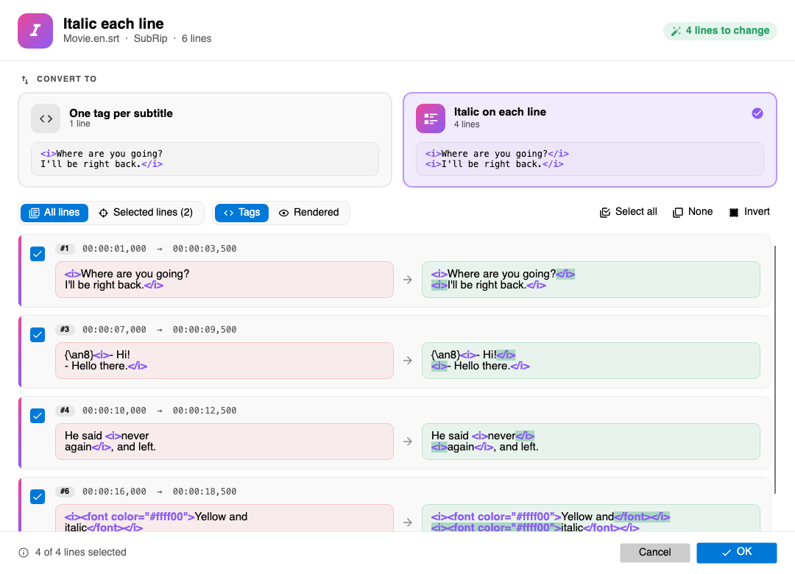

# Italic each line (Subtitle Edit 5 plugin)

Switches italic tags between the two common styles:

| One tag per subtitle | Italic on each line |
|---|---|
| `<i>Where are you going?` `I'll be right back.</i>` | `<i>Where are you going?</i>` `<i>I'll be right back.</i>` |

Some players, burn-in tools and delivery specs need every line to open and close
its own tags; Subtitle Edit itself writes one tag pair. This plugin converts
either way. It is the SE5 port of the SE4 *ItalicEachLine* plugin, which only
did the "each line" direction.

Built on Avalonia and the shared [`Plugin-Shared`](../Plugin-Shared/) library.

## Converting

**Italic on each line**

- Italic still open at the end of a line is closed there and reopened on the
  next line - also when it starts or ends mid-line:
  `He said <i>never` / `again</i>, and left.` becomes
  `He said <i>never</i>` / `<i>again</i>, and left.`
- Tags opened inside the italic (`<b>`, `<u>`, ``) are closed and
  reopened with it, so the tags stay nested.
- Blank lines are not tagged. Unclosed italic at the end of a subtitle is closed.
- ASSA override tags like `{\an8}` are left where they are.

**One tag per subtitle**

- A `</i>` at the end of a line followed by `<i>` at the start of the next
  (blank lines in between allowed) is removed, joining the italic lines into
  one tag pair. Nothing else is touched.

Single-line subtitles never change.

## UI

- Two cards pick the direction; each shows how many lines it would change.
- *All lines* / *Selected lines* - lines selected in Subtitle Edit are the
  default scope.
- *Tags* shows the raw text with tags colored and the changes highlighted;
  *Rendered* hides the tags and shows the italics as they will look.
- Every changed line is a checkable before/after card. *OK* applies the checked
  lines as one "Italic each line" undo step.
- Direction, display and scope are remembered between runs.

Works on the lines exactly as Subtitle Edit holds them, so styles, actors and
other fields of formats like ASSA are kept (falls back to SubRip on older SE
versions).

## Build

See `.github/workflows/italic-each-line.yml`.
