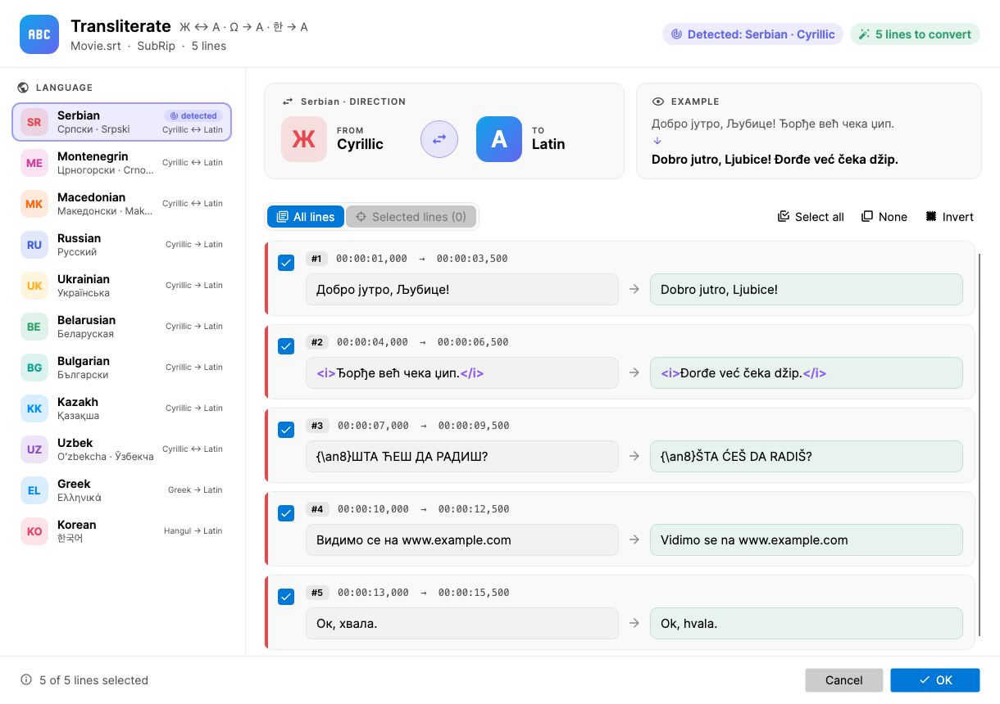

# Transliterate (Subtitle Edit 5 plugin)

Converts subtitle text from one script to another, letter by letter - no
translation, no internet.

| Language | Direction | System |
|---|---|---|
| Serbian | Cyrillic ↔ Latin | Gaj's Latin alphabet (љ = lj, њ = nj, џ = dž, ђ = đ, ћ = ć) |
| Montenegrin | Cyrillic ↔ Latin | As Serbian, plus с́ = ś and з́ = ź |
| Macedonian | Cyrillic ↔ Latin | *Scientific* (ǵ, ž, ḱ, č, dž, š) or *ASCII* (gj, zh, kj, ch, dzh, sh); back to Cyrillic accepts both |
| Uzbek | Cyrillic ↔ Latin | Official Latin alphabet (ў = oʻ, ғ = gʻ, қ = q, ҳ = h, х = x); any apostrophe is accepted |
| Russian | Cyrillic → Latin | *Readable* ASCII (zh, kh, ts, shch, yu, ya; ye at the start of a word) or *ISO 9* (ž, h, c, ŝ, û, â) |
| Ukrainian | Cyrillic → Latin | Official national system, 2010 (г = h, и = y, є/ї/й/ю/я = ye/yi/y/yu/ya at the start of a word, зг = zgh) |
| Belarusian | Cyrillic → Latin | ASCII, BGN/PCGN style (г = h, ў = w) |
| Bulgarian | Cyrillic → Latin | Official Streamlined System, 2009 (щ = sht, ъ = a, final ия = ia) |
| Kazakh | Cyrillic → Latin | Latin alphabet of 2021 (ә = ä, ғ = ğ, қ = q, ң = ñ, ө = ö, ұ = ū, ү = ü, ш = ş, і = ı) |
| Greek | Greek → Latin | ELOT 743 (αυ/ευ = av/ev or af/ef, ου = ou, γγ = ng, μπ = b at the start); `;` becomes `?` |
| Korean | Hangul → Latin | Revised Romanization with linking, ㄹ-assimilation, nasalization and aspiration; sentences start with a capital |

Built on Avalonia and the shared [`Plugin-Shared`](../Plugin-Shared/) library.

## What is kept

- Tags: `<i>`, ``, ASSA override blocks like `{\an8}`.
- URLs and e-mail addresses.
- Case: `Љубав` → `Ljubav`, `ЉУБАВ` → `LJUBAV`.
- Text already in the target script.
- Back to Cyrillic only: words with q, w, x or y (foreign words like *YouTube*),
  Roman numerals (*XIV*) and the *Keep in Latin* list (default: OK, TV, DJ, CD,
  DVD, PC, SMS, FBI, CIA, USB, GPS).
- Serbian words where nj/lj/dž are two letters (*injekcija*, *konjugacija*,
  *nadživeti*) are converted correctly.

## UI

- The language and direction are detected from the letters in the subtitle
  (ђ/ћ/џ → Serbian, ѓ/ќ/ѕ → Macedonian, є/ї → Ukrainian, ў/і → Belarusian,
  ә/қ/ң → Kazakh, ў/қ/ғ/ҳ → Uzbek, ъ → Bulgarian, Greek, Hangul, or
  Serbian Latin with đ/ć/č/š/ž) and marked in the language list.
- A direction card shows from/to scripts with a swap button (for the
  languages that convert both ways), next to a live example.
- *System* buttons for Russian and Macedonian; the choice is remembered per
  language.
- All lines / Selected lines, checkable before/after cards, Select all / None /
  Invert. *OK* applies the checked lines as one undo step.

Works on the lines exactly as Subtitle Edit holds them, so styles, actors and
other fields of formats like ASSA are kept (falls back to SubRip on older SE
versions).

## Build

See `.github/workflows/transliterate.yml`.
